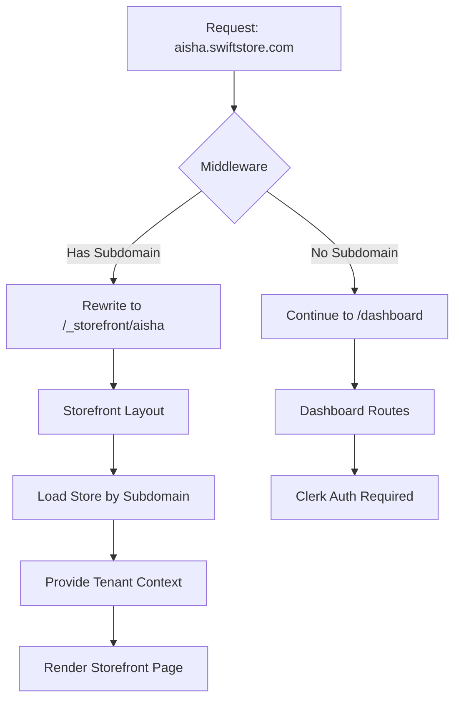

# Phase 3: Multi-tenancy & Routing Implementation Plan

## Overview
Implement subdomain-based multi-tenancy that allows stores to be accessed via `subdomain.swiftstore.com` while keeping the dashboard on the main domain.

## Architecture



## Files to Create

### 1. middleware.ts (Root)
- Detect subdomain from request hostname
- Rewrite requests to internal `/_storefront/[subdomain]` path
- Skip: API routes, static files, _next, dashboard paths
- Attach `x-store-id` header when store is resolved

### 2. lib/tenant.ts
Server-side utilities:
- `getStoreBySubdomain(subdomain: string)` - Fetch store from database
- `getStoreIdFromRequest(req: NextRequest)` - Extract store from middleware header
- `requireTenant()` - Ensure tenant context exists

### 3. app/(storefront)/[subdomain]/layout.tsx
- Fetch store by subdomain param
- Handle 404 if store not found
- Provide store context to children
- Different styling from dashboard (customer-facing)

### 4. app/(storefront)/[subdomain]/page.tsx
- Display store name, description
- List store products with variants
- Add to cart functionality (Phase 4 prep)

### 5. app/api/storefront/[subdomain]/route.ts
Public API endpoint to fetch store data by subdomain

## Files to Modify (Minimal Changes)

### app/api/stores/route.ts
- Add subdomain availability check endpoint (if not exists)

### app/api/products/route.ts
- Add public endpoint variant for storefront (no auth required, scoped by subdomain)

## Key Implementation Details

### Subdomain Extraction Logic
```typescript
const hostname = req.headers.get('host') || '';
const subdomain = hostname.split('.')[0];
// Skip if localhost or main domain
if (subdomain === 'localhost' || subdomain === 'swiftstore') {
  return NextResponse.next();
}
```

### URL Rewrite Pattern
```typescript
// From: aisha.swiftstore.com/products
// To:   swiftstore.com/_storefront/aisha/products
const url = req.nextUrl.clone();
url.pathname = `/_storefront/${subdomain}${url.pathname}`;
return NextResponse.rewrite(url);
```

### Data Isolation
- All Prisma queries in storefront must include `where: { storeId }`
- API routes validate storeId matches the subdomain context
- Middleware ensures store exists before rewriting

## Acceptance Criteria
- [ ] Visiting `aisha.swiftstore.com` displays Aisha's storefront
- [ ] Dashboard remains accessible at `swiftstore.com/dashboard`
- [ ] 404 shown for non-existent subdomains
- [ ] Store data is isolated (cannot access other stores' products)
- [ ] API routes work correctly with tenant context

## Testing Notes
- Test with hosts file or local DNS for subdomain testing
- Verify middleware doesn't interfere with API routes
- Confirm static assets load correctly on subdomains
